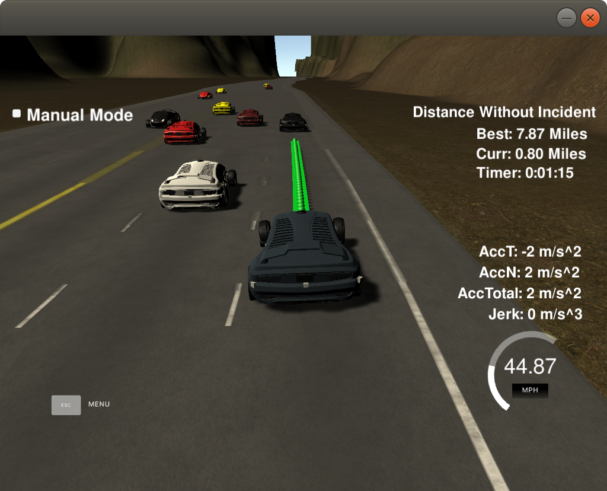

# CarND-Path-Planning-Project
Self-Driving Car Engineer Nanodegree Program
   
### Simulator.
You can download the Term3 Simulator which contains the Path Planning Project from the [releases tab (https://github.com/udacity/self-driving-car-sim/releases/tag/T3_v1.2).  

To run the simulator on Mac/Linux, first make the binary file executable with the following command:
```shell
sudo chmod u+x {simulator_file_name}
```

### Goals
In this project your goal is to safely navigate around a virtual highway with other traffic that is driving +-10 MPH of the 50 MPH speed limit. You will be provided the car's localization and sensor fusion data, there is also a sparse map list of waypoints around the highway. The car should try to go as close as possible to the 50 MPH speed limit, which means passing slower traffic when possible, note that other cars will try to change lanes too. The car should avoid hitting other cars at all cost as well as driving inside of the marked road lanes at all times, unless going from one lane to another. The car should be able to make one complete loop around the 6946m highway. Since the car is trying to go 50 MPH, it should take a little over 5 minutes to complete 1 loop. Also the car should not experience total acceleration over 10 m/s^2 and jerk that is greater than 10 m/s^3.

#### The map of the highway is in data/highway_map.txt
Each waypoint in the list contains  [x,y,s,dx,dy] values. x and y are the waypoint's map coordinate position, the s value is the distance along the road to get to that waypoint in meters, the dx and dy values define the unit normal vector pointing outward of the highway loop.

The highway's waypoints loop around so the frenet s value, distance along the road, goes from 0 to 6945.554.

## Basic Build Instructions

1. Clone this repo.
2. Make a build directory: `mkdir build && cd build`
3. Compile: `cmake .. && make`
4. Run it: `./path_planning`.

Here is the data provided from the Simulator to the C++ Program

#### Main car's localization Data (No Noise)

["x"] The car's x position in map coordinates

["y"] The car's y position in map coordinates

["s"] The car's s position in frenet coordinates

["d"] The car's d position in frenet coordinates

["yaw"] The car's yaw angle in the map

["speed"] The car's speed in MPH

#### Previous path data given to the Planner

//Note: Return the previous list but with processed points removed, can be a nice tool to show how far along
the path has processed since last time. 

["previous_path_x"] The previous list of x points previously given to the simulator

["previous_path_y"] The previous list of y points previously given to the simulator

#### Previous path's end s and d values 

["end_path_s"] The previous list's last point's frenet s value

["end_path_d"] The previous list's last point's frenet d value

#### Sensor Fusion Data, a list of all other car's attributes on the same side of the road. (No Noise)

["sensor_fusion"] A 2d vector of cars and then that car's [car's unique ID, car's x position in map coordinates, car's y position in map coordinates, car's x velocity in m/s, car's y velocity in m/s, car's s position in frenet coordinates, car's d position in frenet coordinates. 

## Details

1. The car uses a perfect controller and will visit every (x,y) point it recieves in the list every .02 seconds. The units for the (x,y) points are in meters and the spacing of the points determines the speed of the car. The vector going from a point to the next point in the list dictates the angle of the car. Acceleration both in the tangential and normal directions is measured along with the jerk, the rate of change of total Acceleration. The (x,y) point paths that the planner recieves should not have a total acceleration that goes over 10 m/s^2, also the jerk should not go over 50 m/s^3. (NOTE: As this is BETA, these requirements might change. Also currently jerk is over a .02 second interval, it would probably be better to average total acceleration over 1 second and measure jerk from that.

2. There will be some latency between the simulator running and the path planner returning a path, with optimized code usually its not very long maybe just 1-3 time steps. During this delay the simulator will continue using points that it was last given, because of this its a good idea to store the last points you have used so you can have a smooth transition. previous_path_x, and previous_path_y can be helpful for this transition since they show the last points given to the simulator controller with the processed points already removed. You would either return a path that extends this previous path or make sure to create a new path that has a smooth transition with this last path.

## Tips

A really helpful resource for doing this project and creating smooth trajectories was using http://kluge.in-chemnitz.de/opensource/spline/, the spline function is in a single hearder file is really easy to use.

---

## Dependencies

* cmake >= 3.5
  * All OSes: [click here for installation instructions](https://cmake.org/install/)
* make >= 4.1
  * Linux: make is installed by default on most Linux distros
  * Mac: [install Xcode command line tools to get make](https://developer.apple.com/xcode/features/)
  * Windows: [Click here for installation instructions](http://gnuwin32.sourceforge.net/packages/make.htm)
* gcc/g++ >= 5.4
  * Linux: gcc / g++ is installed by default on most Linux distros
  * Mac: same deal as make - [install Xcode command line tools]((https://developer.apple.com/xcode/features/)
  * Windows: recommend using [MinGW](http://www.mingw.org/)
* [uWebSockets](https://github.com/uWebSockets/uWebSockets)
  * Run either `install-mac.sh` or `install-ubuntu.sh`.
  * If you install from source, checkout to commit `e94b6e1`, i.e.
    ```
    git clone https://github.com/uWebSockets/uWebSockets 
    cd uWebSockets
    git checkout e94b6e1
    ```
## Result
It can drive for more than 7 miles without incident.



## Implmentation
### Prediction
main.cpp line 100 to line 170
Telemetry and sensor fusion data were used to detect the position of the other cars in different lanes.
* whether there is a car in front / on the left / on the right
* whether other cars are less than 30 meters from our car
```javascript

          // Sensor Fusion Data, a list of all other cars on the same side 
          //   of the road.
	auto sensor_fusion = j[1]["sensor_fusion"];

	int prev_size = previous_path_x.size();

	// avoiding 
	if(prev_size > 0) 
	{
		car_s = end_path_s;
	}

	bool too_close = false;
	bool car_left= false;
	bool car_right = false;
	bool car_ahead = false;
	//find ref_v to use
	for(int i = 0; i < sensor_fusion.size(); i++)
	{
		// car is in my lane
		float d = sensor_fusion[i][6];
		//std::cout << d << "\n";

		int check_car_lane;

		if(d > 0 && d < 4) 
		{
			check_car_lane = 0;
		} 
		else if(d > 4 && d < 8) 
		{
			check_car_lane = 1;
		} 
		else if(d > 8 and d < 12) 
		{
			check_car_lane = 2;
		} 	


		double vx = sensor_fusion[i][3];
		double vy = sensor_fusion[i][4];
		double check_speed = sqrt(vx*vx+vy*vy);
		double check_car_s = sensor_fusion[i][5];	

		// project s value				
		check_car_s+=((double)prev_size*0.02*check_speed);

		bool check_car = ((check_car_s > car_s) && ((check_car_s-car_s) < 30));

		//std::cout << "check:" << d << "," << check_car_lane << "," << lane << "," << check_car << "\n";
		if(check_car_lane == lane) 
		{
			//A vehicle is on the same lane
			car_ahead |= check_car;										

		} 
		else if((check_car_lane - lane) == -1) 
		{
			//A vehicle is on the left lane 
			car_left |= check_car;
		} 
		else if((check_car_lane - lane) == 1) 
		{
			//A vehicle is on the right lane
			car_right |= check_car;			
		}				
	}
```


### Behaviour
main.cpp line 173 to line 185
Keep the car under the speed limit, and find a lane to change to if there is a car in front.

```javascript
if(car_ahead)
{
   ref_vel -= 0.224;
   
   //change to left first if possible, otherwise check whether right is possible
   if(!car_left && (lane > 0)) 
      lane = lane - 1;
   else if (!car_right && (lane < 2))
      lane = lane + 1; 
}
else if (ref_vel < 49.5)
{
    ref_vel += 0.224;
}
```
### Trajectory generation

In order to make a smooth trajectory, a spline line is used to smooth out the waypoints. 
The coordinates are transformed back to local car coordinates at the end of the calculation.

main.cpp line 241 to line 296
```javascript
	for ( int i = 0; i < ptsx.size(); i++ ) 
	{
		double shift_x = ptsx[i] - ref_x;
		double shift_y = ptsy[i] - ref_y;

		ptsx[i] = shift_x * cos(0 - ref_yaw) - shift_y * sin(0 - ref_yaw);
		ptsy[i] = shift_x * sin(0 - ref_yaw) + shift_y * cos(0 - ref_yaw);
	}

	// Create the spline.
	tk::spline s;

	s.set_points(ptsx, ptsy);

	// Define the actual points			
	vector<double> next_x_vals;
	vector<double> next_y_vals;

	// Start with all of the pre path
	for ( int i = 0; i < previous_path_x.size(); i++ ) 
	{
		next_x_vals.push_back(previous_path_x[i]);
		next_y_vals.push_back(previous_path_y[i]);
	}

	// Cal our desired ref velocity
	double target_x = 30.0;
	double target_y = s(target_x);
	double target_dist = sqrt(target_x*target_x + target_y*target_y);

	double x_add_on = 0;

	// Fill up the rest of our path planner
	for( int i = 1; i <= 50 - previous_path_x.size(); i++ ) 
	{


		double N = (target_dist/((0.02*ref_vel)/2.24));
		double x_point = x_add_on + (target_x)/N;
		double y_point = s(x_point);

		x_add_on = x_point;

		double x_ref = x_point;
		double y_ref = y_point;

		//Rotate back to normal after rotating it earlier
		x_point = (x_ref * cos(ref_yaw) - y_ref * sin(ref_yaw));
		y_point = (x_ref * sin(ref_yaw) + y_ref * cos(ref_yaw));

		x_point += ref_x;
		y_point += ref_y;

		next_x_vals.push_back(x_point);
		next_y_vals.push_back(y_point);
	}
'''
